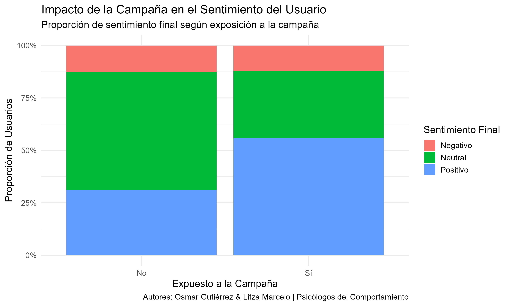

# Análisis de Sentimiento en App de Noticias

## 1. Contexto del Proyecto

Este proyecto simula una consultoría para una empresa de medios digitales. El objetivo es analizar el perfil de los usuarios de su aplicación de noticias y medir el impacto de una reciente campaña publicitaria en el sentimiento de los mismos para guiar futuras inversiones de marketing.

## 2. Pregunta de Análisis

El análisis busca responder dos preguntas clave: 1. ¿Cuál es el perfil demográfico general de los usuarios de la aplicación? 2. ¿Existe una correlación observable entre la exposición a la campaña y un cambio en el sentimiento de los usuarios?

## 3. Metodología

Se utilizó un enfoque de **Análisis Exploratorio de Datos (EDA)** en R. A partir de un dataset simulado de 1,000 usuarios, se generaron visualizaciones para comparar las distribuciones demográficas y, crucialmente, para contrastar la proporción de sentimientos (`Positivo`, `Neutral`, `Negativo`) entre el grupo de usuarios expuesto a la campaña y el grupo de control.

## 4. Hallazgo Clave

El análisis reveló una **fuerte correlación positiva** entre la exposición a la campaña y una mejora en el sentimiento. El principal efecto observado fue la conversión de usuarios con sentimiento **"Neutral"** a **"Positivo"**.

## 5. Estrategia Propuesta

Basado en el hallazgo de una correlación (y no una causalidad confirmada), la recomendación estratégica de máximo ROI es la ejecución de una **Prueba A/B controlada**. Este paso es crucial para validar científicamente el impacto de la campaña antes de escalar la inversión.
